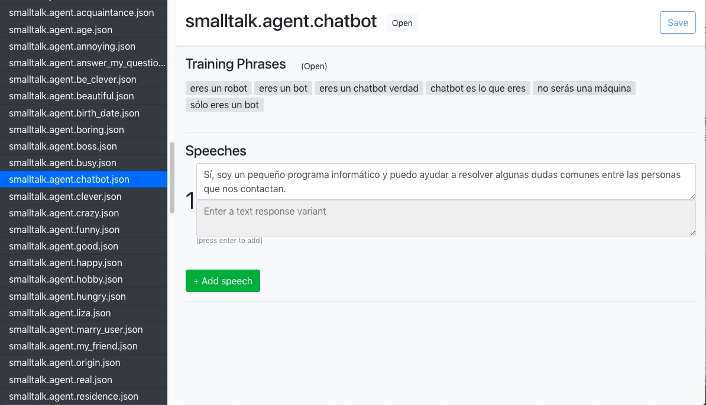

# HW Dialogflow JSON editor

Editor to modify the _speeches_, _suggestions_ and _redirect_to_blocks_
(used for [Janis](https://www.janis.ai) + [Chatfuel](https://chatfuel.com) integrations) of Dialogflow intents.

This is a frontend app + bakend api

You can configure any text editor (or other app) to open the json files in
`config/server.js`. Just set the full path of your text editor's executable:
```
 - win32: for windows
 - linux: for linux
 - darwin: for mac
```

## Project setup
```
npm install
```

### Compiles and hot-reloads for development
```
npm run serve
```

### Run backend api for development 
```
node server.js
```

### Compiles and minifies for production
```
npm run build
```

### Lints and fixes files
```
npm run lint
```
---
### Run both servers
If you don't need to run backend and frontend servers independently (development mode),
you can run both.

You have to install `serve` first
```
npm install -g serve
```
Build
```
npm run build
```

Then run

```
npm start
```

And go to http://localhost:5000



### Instructions for use:

1. From Dialogflow's console export agent as zip
2. Unzip the zip in a local folder
3. In the editor indicate the path to the folder containing the json files
4. Use the editor to modify the editable fields
5. Create a new zip with the modified json files
6. Import intents in Dialogflow using Restore from zip option or Import from zip as deemed convenient

### Todo

The current version assigns the Spanish language to the new speech.
Make it take the language of the first speech of the json itself.